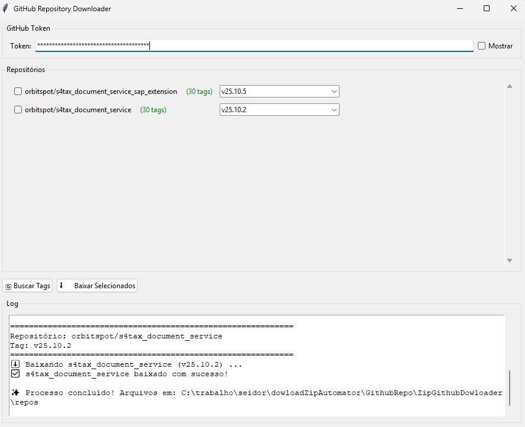

# GitHub Repository Tag Downloader

Aplicação Python com interface gráfica para baixar repositórios do GitHub a partir de tags específicas.



## 👤 Autor

**RenatoMAP77** - [GitHub](https://github.com/RenatoMAP77)

## 📋 Descrição

Este projeto oferece uma interface gráfica intuitiva para baixar o código-fonte (.zip) de múltiplos repositórios do GitHub baseado em tags específicas. Você pode visualizar todas as tags disponíveis de cada repositório e escolher exatamente qual versão deseja baixar.

## ✨ Funcionalidades

- ✅ Interface gráfica intuitiva com Tkinter
- ✅ Visualização de todos os repositórios configurados
- ✅ Seleção individual de repositórios via checkbox
- ✅ Busca e listagem de **todas as tags** disponíveis para cada repositório
- ✅ Escolha manual de qual tag baixar
- ✅ Download paralelo (não trava a interface)
- ✅ Log em tempo real do processo
- ✅ Campo seguro para inserir o GitHub Token (com opção de mostrar/ocultar)
- ✅ Downloads organizados automaticamente na pasta `repos/`

## 🔧 Requisitos

- Python 3.7+
- Biblioteca `requests`

## 📦 Instalação

1. Clone o repositório:
```bash
git clone https://github.com/RenatoMAP77/ZipGithubDownloader.git
cd ZipGithubDownloader
```

2. Instale as dependências:
```bash
pip install requests
```

3. Configure o arquivo `repo-metadata.json` com seus repositórios:
```json
[
  {
    "repo_owner": "usuario",
    "repo_name": "nome-do-repositorio"
  },
  {
    "repo_owner": "usuario",
    "repo_name": "outro-repositorio"
  }
]
```

## 🚀 Como Usar

### Executando a aplicação

```bash
python DownloadAutomatorGui.py
```

### Passo a passo

1. **Insira o GitHub Token**
   - Cole seu token no campo indicado
   - Marque "Mostrar" se quiser visualizar o token enquanto digita
   - O token é necessário para acessar a API do GitHub

2. **Selecione os repositórios**
   - Marque os checkboxes dos repositórios que deseja trabalhar
   - Você pode selecionar um ou vários repositórios

3. **Busque as tags disponíveis**
   - Clique no botão **"🔄 Buscar Tags"**
   - Aguarde enquanto o sistema busca todas as tags de cada repositório selecionado
   - O número de tags encontradas aparecerá ao lado de cada repositório

4. **Escolha qual tag baixar**
   - Para cada repositório, selecione a tag desejada no menu dropdown
   - Você pode escolher diferentes tags para diferentes repositórios

5. **Inicie o download**
   - Clique em **"⬇️ Baixar Selecionados"**
   - Acompanhe o progresso no log na parte inferior
   - Os arquivos serão salvos na pasta `repos/`

## 🔑 Obtendo um GitHub Token

1. Acesse [GitHub Settings → Developer settings → Personal access tokens](https://github.com/settings/tokens)
2. Clique em **"Generate new token (classic)"**
3. Dê um nome descritivo ao token (ex: "Downloader App")
4. Selecione o escopo **`repo`** (acesso completo a repositórios)
5. Clique em **"Generate token"**
6. **Copie o token** (ele não será mostrado novamente!)

⚠️ **Importante**: Guarde seu token em local seguro. Nunca compartilhe ou commite o token no Git.

## 📁 Estrutura de Arquivos

```
ZipGithubDownloader/
├── DownloadAutomatorGui.py        # Aplicação principal
├── repo-metadata.json             # Lista de repositórios
├── repos/                         # Pasta com downloads (criada automaticamente)
│   ├── repo1-v1.0.0.zip
│   ├── repo2-v2.5.3.zip
│   └── ...
└── README.md
```

## 📝 Formato do repo-metadata.json

O arquivo `repo-metadata.json` deve conter uma lista de objetos JSON com os campos `repo_owner` e `repo_name`:

```json
[
  {
    "repo_owner": "usuario",
    "repo_name": "nome-do-repositorio"
  },
  {
    "repo_owner": "usuario",
    "repo_name": "nome-do-repositorio"
  }
]
```

## 🎯 Casos de Uso

- **Backup automatizado**: Baixar tags específicas de múltiplos repositórios
- **Deploy**: Obter versões específicas para ambientes de produção/homologação
- **Arquivamento**: Manter cópias locais de releases importantes
- **Desenvolvimento**: Trabalhar com versões específicas offline
- **Migração**: Transferir código entre ambientes sem Git instalado

## 📸 Interface

A aplicação possui uma interface dividida em seções:

- **Token**: Campo para inserir o GitHub Token com opção de mostrar/ocultar
- **Repositórios**: Lista com checkboxes e dropdowns de tags para cada repositório
- **Ações**: Botões para buscar tags e iniciar downloads
- **Log**: Área de texto com feedback em tempo real do processo

## ⚠️ Notas Importantes

- Certifique-se de que seu token tem permissões adequadas para acessar os repositórios
- Repositórios privados requerem um token com escopo `repo`
- A pasta `repos/` será criada automaticamente se não existir
- Arquivos são nomeados no formato: `nome-do-repo-nome-da-tag.zip`
- Downloads são feitos em threads separadas para não travar a interface
- A aplicação exibe mensagens de erro se houver problemas de autenticação ou rede

## 🐛 Solução de Problemas

**Erro: "Arquivo repo-metadata.json não encontrado!"**
- Verifique se o arquivo está na mesma pasta que o script
- Confirme se o nome do arquivo está correto

**Erro ao buscar tags**
- Verifique se o token está correto e não expirou
- Confirme se o token tem permissões adequadas
- Verifique sua conexão com a internet

**Nenhuma tag encontrada**
- Confirme se o repositório realmente possui tags criadas
- Verifique se o nome do proprietário e do repositório estão corretos no JSON

## 📄 Licença

Este projeto é de código aberto e está disponível sob a licença MIT.

## 🤝 Contribuições

Contribuições são bem-vindas! Sinta-se à vontade para abrir issues ou pull requests.

---

**Desenvolvido por RenatoMAP77** 🚀